# Picker Dollies

This mod allows you to move blocks or entire builds quickly and easily. Inspired by the [Factorio mod of the same name](https://mods.factorio.com/mod/PickerDollies) and [Axiom](https://modrinth.com/mod/axiom) build tools. Using a configurable *wand item*, this this mod allows you to utilise a set of operations which move, duplicate or otherwise modify blocks.

The motivation for this work is the incompatibility between Axiom build tools and [Sable](https://modrinth.com/mod/sable), but also a desire to have a simple implementation of a selection of build tools which do not require an entire Axiom installation and the limitations that come with it, such as limited multiplayer functionality and missing NeoForge support.

## Operations

  - **Move:** Move, rotate, or flip a structure
  - **Clone:** Create a copy of a structure
  - **Fill:** Fill your selection with a desired block
  - **Stack:** Create multiple copies of a structure with configurable spacing and offsets

### Notable features

  - **Mirroring and rotation**
  - **Support for tile entities**
  - **Persistent Clipboard:** Synchronised across worlds and servers, even through game restarts
  - **Sable compatibility:** Not only enabling easy modification of structures on sublevels, but also moving/coping blocks from, into, and between sublevels

### Extra functionality

  - **Creative flight noclip:** Allows creative players to phase thought blocks during flight as if they were in spectator

# Showcase

# Guide

This mod does not add any items, instead it uses a designated *wand item* (configurable in client settings), which will bring out the mod interface. As a nod to World Edit, the default *wand item* is the wooden axe.

All keybindings are likewise configurable, so the defaults will be used in this guide. All possible actions are always displayed on the screen, along with their respective keybindings.

## Selection

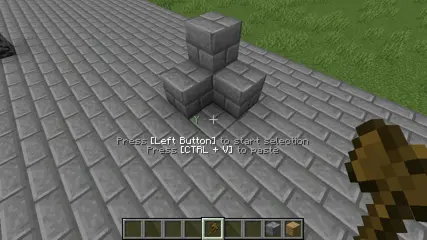

To start using this mod, start a selection by using <kbd>Left Click</kbd> on a block. Clicking on additional blocks will expand the selection to encompass them. You can discard a selection using <kbd>Right Click</kbd>. The selection is visualised using a cyan box.

To select an operation you wish to use, hold down <kbd>X</kbd> and scroll. To activate the selected operation, follow the individual instructions. 

As the action of scrolling is utilised by the mod, selecting a different hotbar slot during an active selection/operation requires the use of number keys or putting the *wand* into the offhand.

## Move Operation

There are two ways of moving of a structure: using the scroll wheel or dragging the mouse while holding down <kbd>Middle Button</kbd>.

### Using a scroll wheel

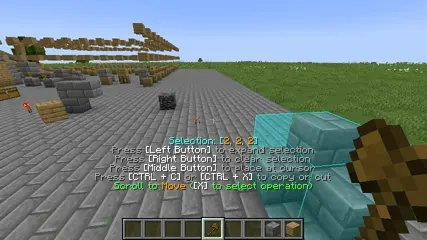

The axis of movement is determined by the camera angle, the current axis is indicated by the axis indicator by the crosshair. Scrolling down will bring the structure towards the player and scrolling up will do the opposite.

### Dragging the mouse

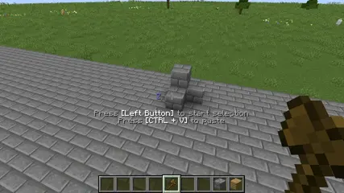

Point your cursor over a side of the movement bounding box and hold down the <kbd>Middle Button</kbd>. Moving your cursor in this state will move the structure to follow. Movement is restricted to the plane of the face of the bounding box you have originally pointed at.

You can also moving during this time, the structure will follow your player's movement in the movement plane.

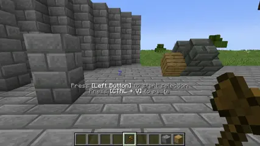

To move a structure a larger distance or between sublevels/dimensions, click the <kbd>Middle Button</kbd> outside your structure and onto an external block. The structure will be brought over to touch the block.

### Confirming or cancelling the movement

Pressing <kbd>Left Button</kbd> will finish the movement and remove the original blocks. Pressing <kbd>Right Button</kbd> will abort the operation, not any change to the world.

### Mirroring and rotation

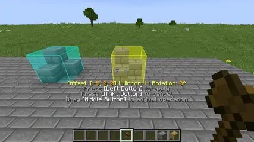

You can horizontally mirror your structure by pressing the <kbd>Home</kbd> button. The axis of the flip is determined via your camera angle. 

You can rotate your structure by pressing the <kbd>Page Up</kbd> button. The structure is always rotated 90° on its vertical axis.

## Clone Operation

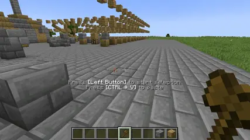
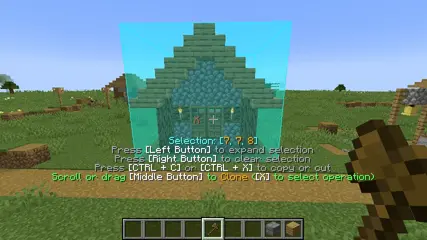

The controls of the clone operation are identical with the **Move Operation**, with the notable difference of not removing the original blocks when the operation is applied. Instead a copy of the structure will be stamped into the world. The operation will not automatically abort (configurable), allowing you to easily stamp multiple copies in a row.

Unlike the **Move Operation** the structure to be cloned is snapshotted the moment the operation starts and further changes while the operation is active do not affect its results.

### Using the clipboard

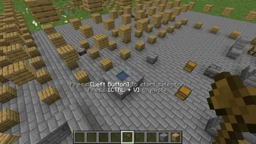

When an operation starts or upon pressing <kbd>Ctrl + C</kbd>, the current selection will be put into your clipboard. You can also use <kbd>Ctrl + X</kbd>, which will additionally empty the selection.

Pressing <kbd>Ctrl + V</kbd> at any moment while holding the *wand* and not having a selection/operation active will start the **Clone Operation**, with the structure in your clipboard loaded, at your cursor. You can use the normal controls to adjust the positioning of the structure and the stamp it into your world. The clipboard is also updated every time you use an operation.

The clipboard is persistent between world and servers, and remains after game restarts. The structure is saved to the `picker_dollies_clipboard.nbt` file in the root of your game folder and loaded at startup.

You can interact with the clipboard using these client side commands:

  - `/picker clipboard`: Prints whether you have something in your clipboard 
  - `/picker clipboard clear`: Clears the clipboard (the structure file will remain on your disk)
  - `/picker clipboard load`: Reloads the clipboard from disk
  - `/picker clipboard save`: Overwrites the structure file on disk

## Adjust Selection Operation

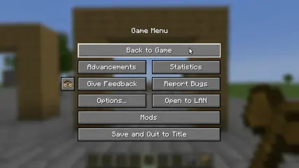

This operation allows to move and resize your selection without having to click on any blocks. While this operation is active, you can move your selection as you would move a structure with the **Move Operation**. 

### Resizing the selection

You can resize the selection by holding <kbd>X</kbd>. When scrolling, you will move the face of the bounding box opposite of you in the axis as determined by your camera angle.

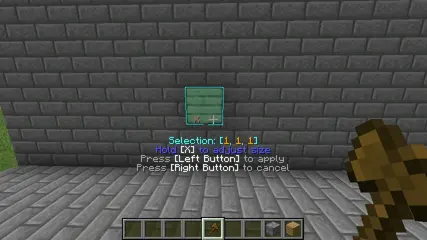

When dragging, you will move the edge closest to your cursor in the plane of the face your have selected. 

## Fill Operation

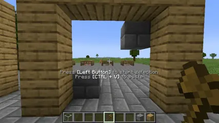

Click the <kbd>Middle Button</kbd> while looking at a block. This block will be used to fill the volume of your selection.

## Stack operation

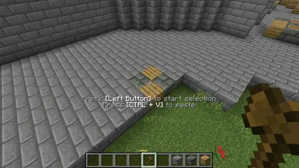
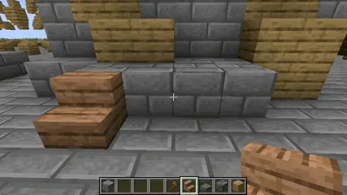

This operation is very complex and has still some UX problems. Using this operation, you can duplicate a structure many times with adjustable spacing and offsets. To specify in which directions, and how many times, the structure will be duplicated, you can either use your scrollwhell or drag using the <kbd>Middle Button</kbd> and behaves similarly to the **Adjust Selection Operation**.

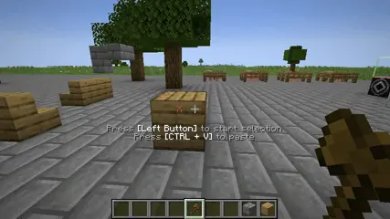

### Adjusting the spacing and offsets

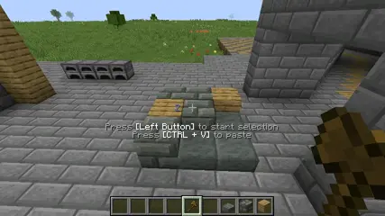

You can adjust the gaps or offsets between created structures by holding <kbd>X</kbd>.

## Creative flight noclip

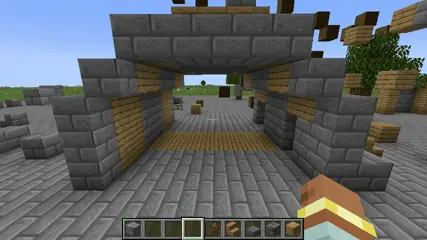

This feature is disable by default and can be enabled in the server settings. When active, all creative players will phase through block when flying, as if they were in spectator. 

# Details

## Structures

This mod operates by utilizing Minecraft's `StructureTemplate` API, the same as used by [structure blocks](https://minecraft.wiki/w/Structure_Block) or by [Create](https://modrinth.com/mod/create) schematics. It, being a standard part of Minecraft, should ensure the widest compatibility with other mods.

To create the preview of your structure, the server creates a structure template the moment you activate an operation and sends it to the client. The client also uses this structure template for its clipboard.

When pasting, to allow the transfer of structures between worlds, the client sends the structure template to the server. This is subject to packet size limitations, but compression is used for this purpose, so a user is unlikely to encounter any problems.

Because of this direct sending of structure templates, there is a security consideration. For the sending of server to client, the client will receive all world data of the region they have selected, including the contents of containers.

For the sending of client to server, the client can send any kind of structure, even those which shouldn't be creatable normally. Additionally, while the size of the entire network packet is limited, there is no limit to the uncompressed size of the structure template.

It is recommended to only use this mod in multiplayer when you trust all involved players.

## Mod keybindings

To capture mouse and scrollwhell events and avoid conflicts with standard Minecraft behaviour, this mod listens directly on NeoForge's `InputEvent`s and cancels them if they match a keybinding. This behaviour is active while the *wand* is held.

Unfortunately, keyboard events cannot be cancelled, so conflicts with other key-based keybindings are not avoidable. 

## Sable integration

This mod uses the [Sable Companion](https://github.com/ryanhcode/sable-companion) library to understand sublevels. When a selection or an operation is used on a sublevel, this library is used to generate a `Matrix4d`, which is then used to transform all inputs into the local space of the sublevel, and transform all visualisation back into world space. 

This means that moving by scrolling is always accurate to the camera view, even when the sublevel is rotated. You can observe this behaviour by creating a selection inside a sublevel and watching as the axis indicator next to the crosshair shows the axes of the sublevel instead of the world space ones.

## Creative flight noclip

To enable the behaviour of phasing through blocks, the mod temporarily overrides the players's gamemode to spectator during the execution of the player entity's tick function. As this modification is only applied for that specific time window, it doesn't affect anything else except for physics. 

This modification is done both on the client and the server. On the server side, the `ServerPlayer`'s `ServerPlayerGameMode` object will be modified, setting its `gameModeForPlayer` field to `GameType.SPECTATOR`. On the client side, the `PlayerInfo` associated with the player's UUID will be modified, setting its `gameMode` field.

Modified entities are stored in a collection. Upon the conclusion of the tick, these changes are reverted by setting the respective fields back to `GameMode.CREATIVE`.

